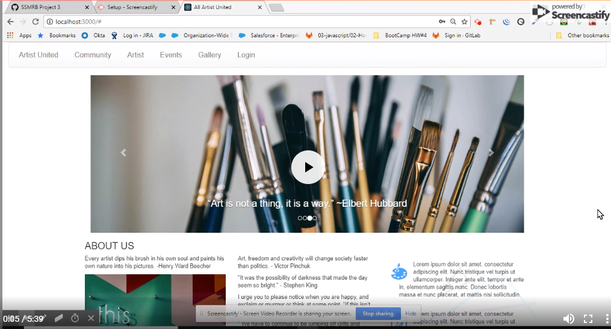
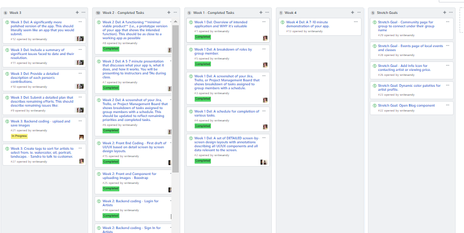
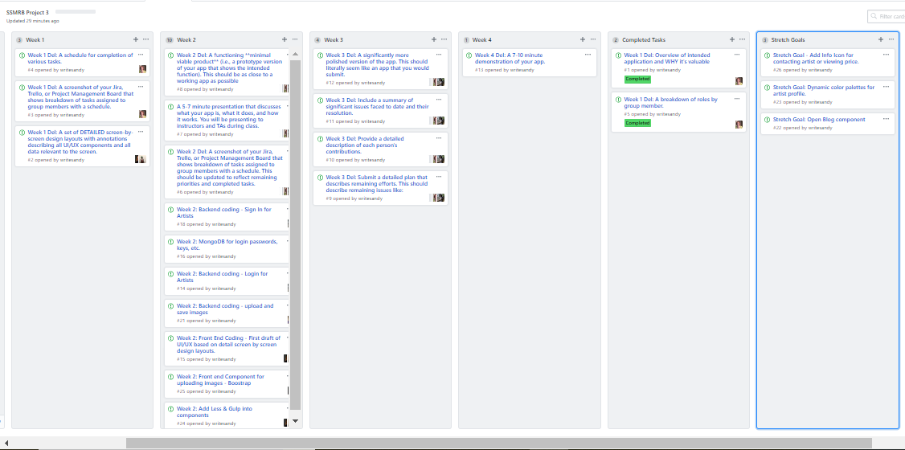
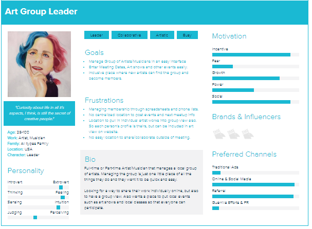
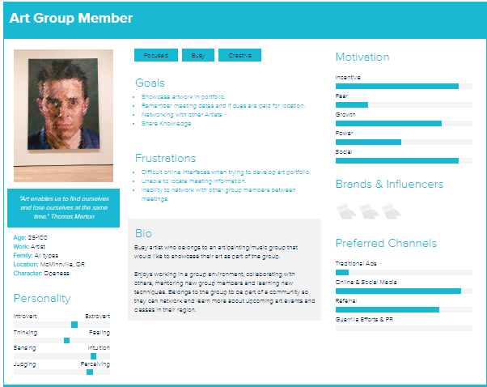
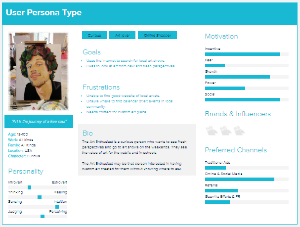

# SSMRB - Project #3

# Week Three Deliverables

## Team Member Contributions

* Brandon Vreeman - Image Uploader, Gallery Links, Firebase Storage, Testing
* Madison Kock - Front End Coding, Front End/Back End connections, Testing
* Sama Sandy - Front End Desing and Coding, Original Adobe DX design docs, Customizable image grid on homepage, Testing
* Rikki Honnold - Sign In and Sign Up API, Routes & Connections, assisted with Front End Design of pages
* Sandra Peterson - Routes, ReadMe, Content and Image Collection, Seeds files, Testing

## Summary of Issues

* Image Uploader - The image uploader has been especially difficult as we tried to connect it to MongoDB as part of the class requirements. MongoDB does not have enough storage capability for images. The storage method was changed to Firebase and it is now working in development.

* Sign In page - Sign in page original setup had a hiccup with naming that we have not been able to clear in GitHub. We have tried everything from changing it in everyone's branches to going on GitHub and making the correction. It stubbornley reverts and causes the app to not compile when it is pulled new from the master.

* Heroku link - This is still actively being worked. The links work in the local version on the Artist Bio page, but do not work from Heroku for the artist instagram, linkedin, etc.

## Completion Plan

* Complete final Image Uploader functionality to Gallery page
* Links to show Gallery Photos and Artist Bio Photos from Firebase images
* Finish collecting and uploading Artist Bio and images from clients
* Complete final touches on Sign In/Sign Up pages (polish)
* Change Name of app from All Artist United to Clients's Choice
* Add settings page for adjusting users settings if time allows

## Future Enhancements
* ```Community page for artists and others to communicate with eachother through the app```
* ```Events page for listing local art shows and classes```
* ```Info Icon for contacting artist or viewing price of art```
* ```Dynamic color palettes for artist profiled (light, dark and muted)```
* ```Open Blog Component```


# Week Two Deliverables

## Link to All Artist United - Minimally viable product
### <a href="https://allartistunited.herokuapp.com/">All Artist United</a>

## Link to Demo Video 

[](https://youtu.be/rnKlSQmTvUg)

## *__Week 2 Project Board/Schedule__*
(click image to go to full page)

<a href="https://github.com/writesandy/SSMRB/projects/1"></a>


# Week One Deliverables

## *__Project Definition and Value__*

### Our team was approached by All Media Painters in McMinneville, Oregon to develop a website for their painting group. The artists in the group meet weekly to work on art and occaisionally individual members accept commissions for custom artwork. 

### Our team decided to scale the app to serve a wider audience, while meeting the needs of AMP-McMinneville. The app will support the art community meeting needs for small groups or independent artists to:

1. Upload images into standard portfolio to showcase their art.
2. Provide community visibility for local artists.
3. Facilitate communication of events.
4. Community for sharing tips and methods for varied artistic mediums.
3. Create a location for artists to make contacts for commission work.
5. Artist page for view of all artist
6. Artist Bio page for each artist to individually showcase their art.

## *__Team Roles__*

* ```Brandon Vreeman - Web Development & Production, PM```
* ```Madison Koch - Interface Experience/Design, Web Development & Production```
* ```Rikki Honnold - Project Management, Web Development & Production```
* ```Sama Sandy - Interface Experience/Design, Web Development & Production, SEO```
* ```Sandra Peterson - Web Development & Production, PM```

## *__Week 1 Project Board/Schedule__*
(click image to go to full page)

<a href="https://github.com/writesandy/SSMRB/projects/1"></a>

## *__UI/UX PureComponent Views__*
<a href="https://xd.adobe.com/view/11a68c82-c643-42f9-6a28-9af1a68ff448-6797/">Click to View Dynamic UI/UX in XD Adobe</a>

## *__Xtensio User Profiles__*
(click image to go to full page)
 
<a href="https://app.xtensio.com/lp04bthh"></a>
<a href="https://app.xtensio.com/lp04bthh"></a>
<a href="https://app.xtensio.com/lp04bthh"></a>
